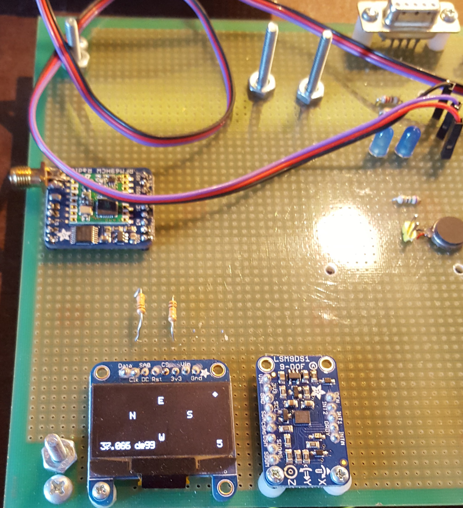
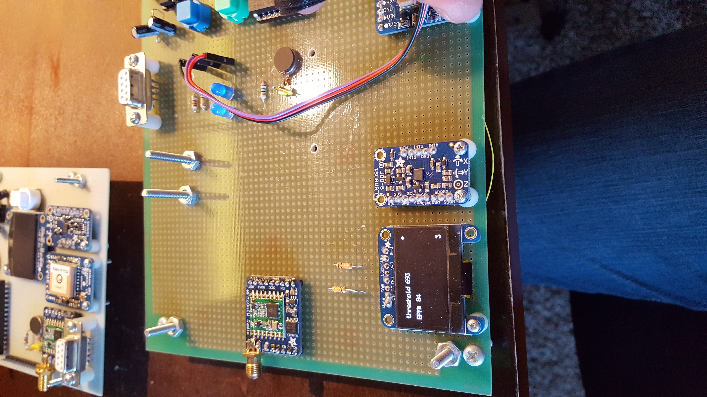
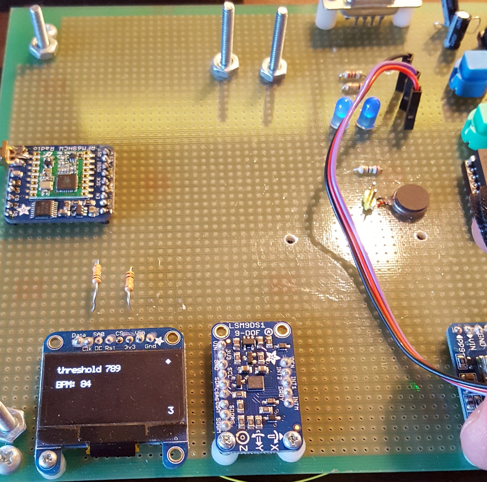
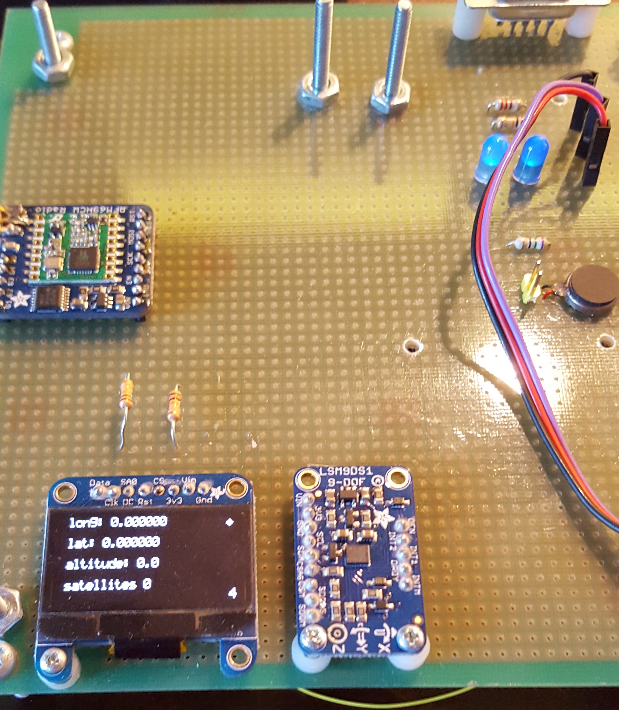
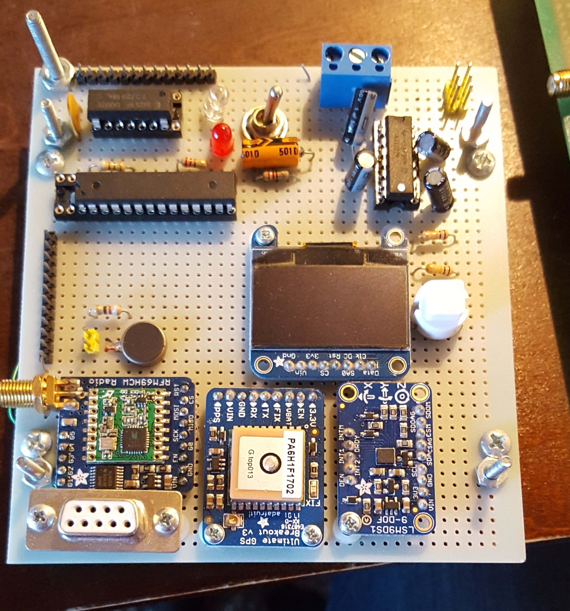

# Atmel-GPS-Sensor-Watch

This project uses an Atmel 328 microProcessor along with a host of other components such as an LED screen, heart rate monitor, GPS, RF communication. 
It also impliments the following communication protocols: Serial, I2C, and SPI. 
For a detail description of the project view Progrject Report

There are two main files to run two different devices: Menu & Menu_small 
- Menu_small : is for a device that doesn't have a heart rate monitor. It is meant to be the beackon that is being tracked.
- Menu: is for the main the device that has the heart rate monitor and is meant to be the device that is tracking. 

